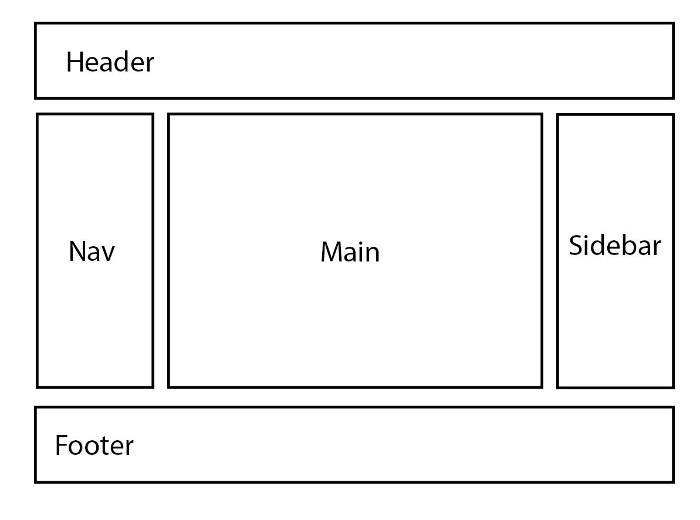
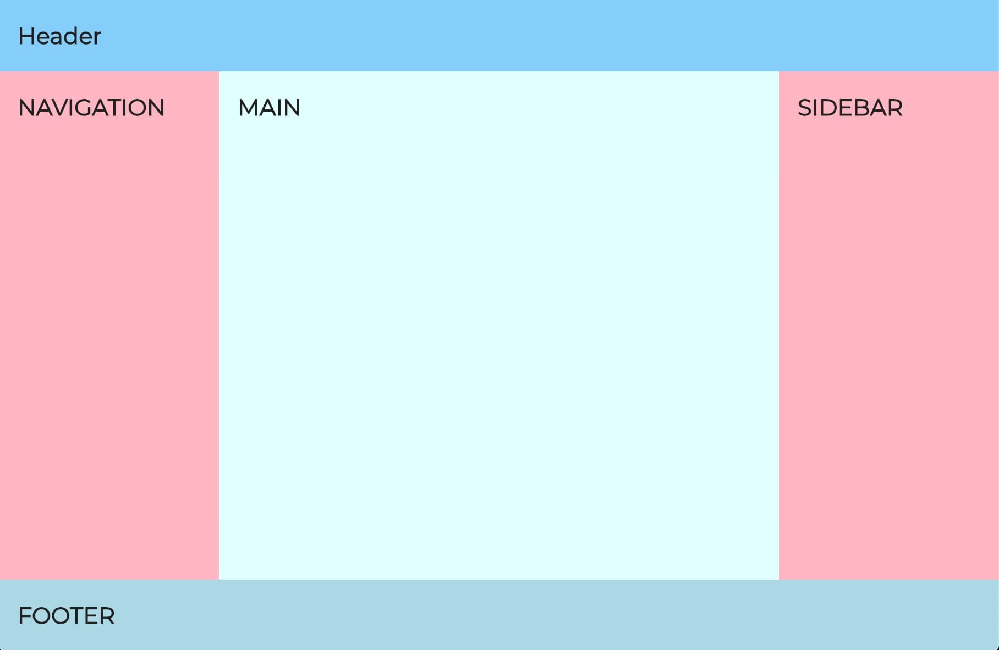
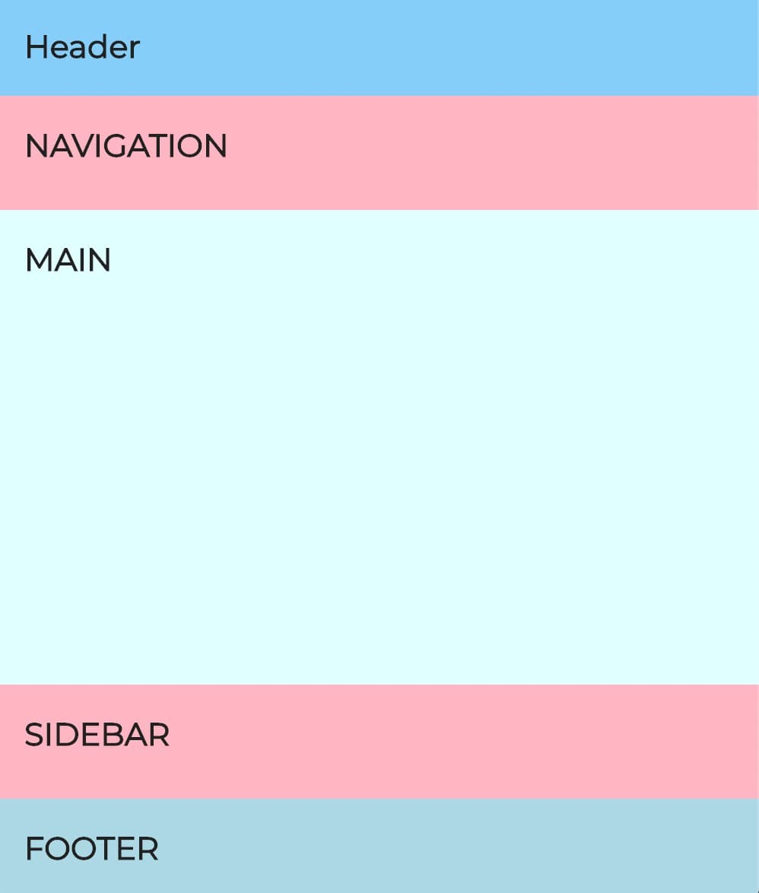
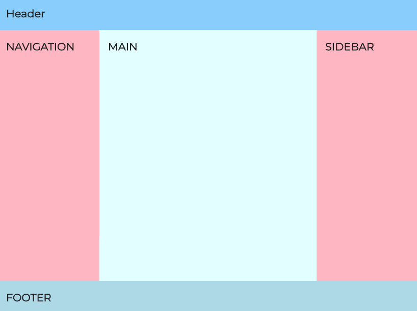

# Design challenge

## 02. Holy Grail Layout

**Modify your HTML and CSS from _Challenge 01_ so that your design also includes a side navigation and a sidebar — also known as the Holy Grail Layout. As before, your webpage should always be at least the height of the window even when the content isn't enough to fill it.**

---

This challenge contains some materials to get you started.  
Copy everything from the `assets` folder, to the `solution` folder.  
Use the terminal, and write: `cp ./assets/* ./solution/`

NB! Remember to copy it to the right folder.

---

Create the HTML for this simplistic layoutdiagram:

Like with **Challenge 01**, populate your page with some content. The header with a h1 saying "header", main with a h1 saying "main", followed by some paragraphs of lorem-ipsum text (tip: use Emmet), and finally the footer has yet another h1 in it.

Then modify the CSS so that the sidebar and the side navigation is 200px wide at the most in the desktop version. The sidebar and the side navigation should always take up the full height of the main content area spaning from the header to the footer at the bottom of the screen.

Desktop Layout

Mobile Layout

Animation of the responsiveness

Make sure it also works with a lot of content!
