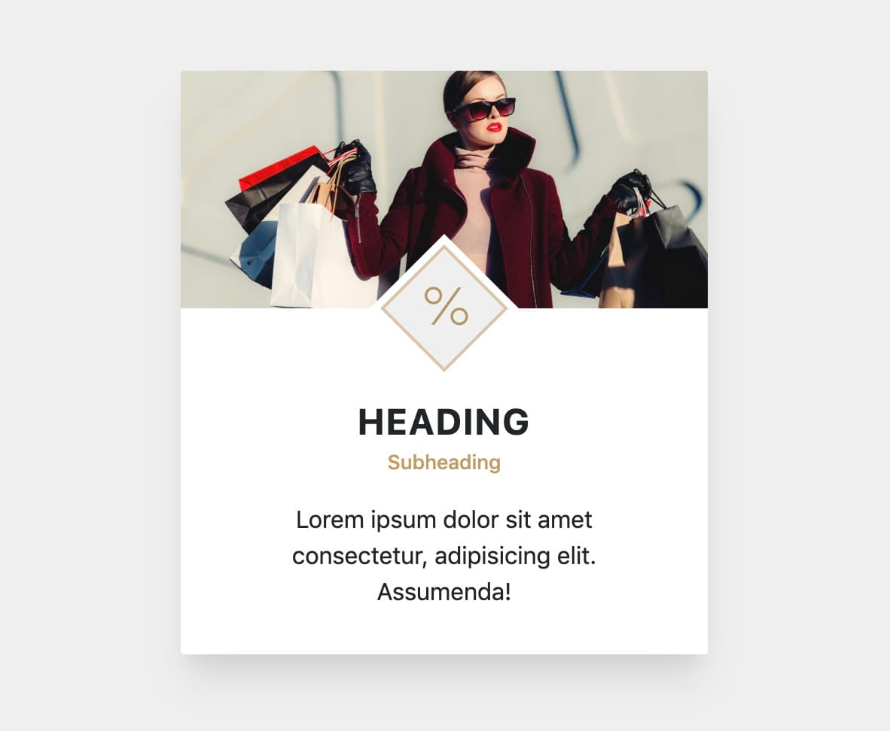

# Design challenge

## 03. Rotated Logo

**Recreate the following card layout:**

---

This challenge contains some materials to get you started.  
Copy everything from the `assets` folder, to the `solution` folder.  
Use the terminal, and write: `cp ./assets/* ./solution/`

NB! Remember to copy it to the right folder.

---

You should be able to achieve the desired design by only modifying the stylesheet called `styles.css`.

The color for the sub-heading is `#c39b5f`
