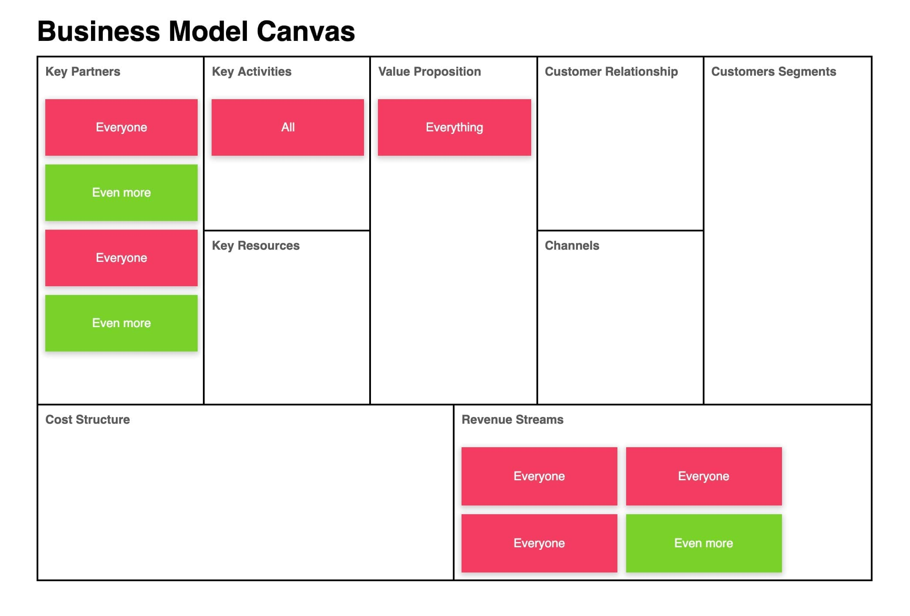

# Design challenge

## 04. Business Model Canvas

**Create the following layout structure:**

---

This challenge contains some materials to get you started.  
Copy everything from the `assets` folder, to the `solution` folder.  
Use the terminal, and write: `cp ./assets/* ./solution/`

NB! Remember to copy it to the right folder.

---

Use CSS Grid for the layout structure and place post-it notes inside as you see above.

**_Extra credit_**

Try to make it responsive. Ask yourself how that might come about.
