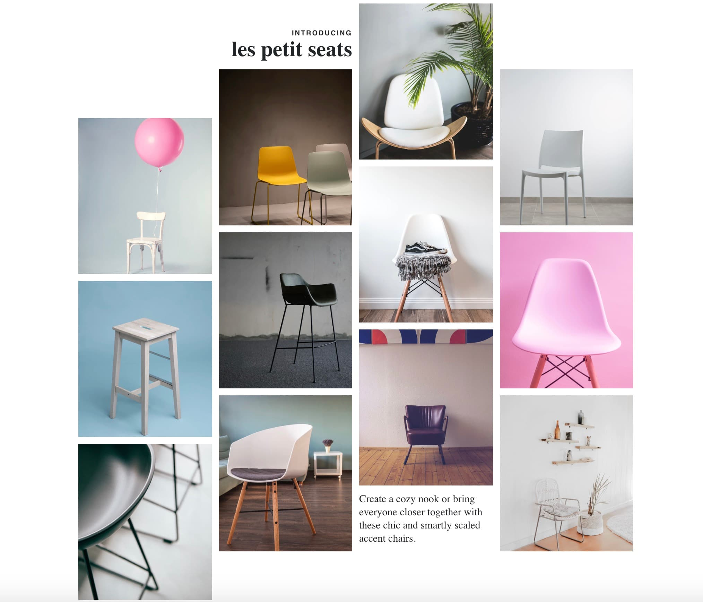

# Design challenge

## 05. Le Petit Seats

**Create the following layout structure:**

---

This challenge contains some materials to get you started.  
Copy everything from the `assets` folder, to the `solution` folder.  
Use the terminal, and write: `cp ./assets/* ./solution/`

NB! Remember to copy it to the right folder.

---

Introduce CSS grid on `<section class="grid">` and place the individual image figures on that grid. The images must be in the same order as you see above.

**_Extra credit_**

Try to make it responsive.
