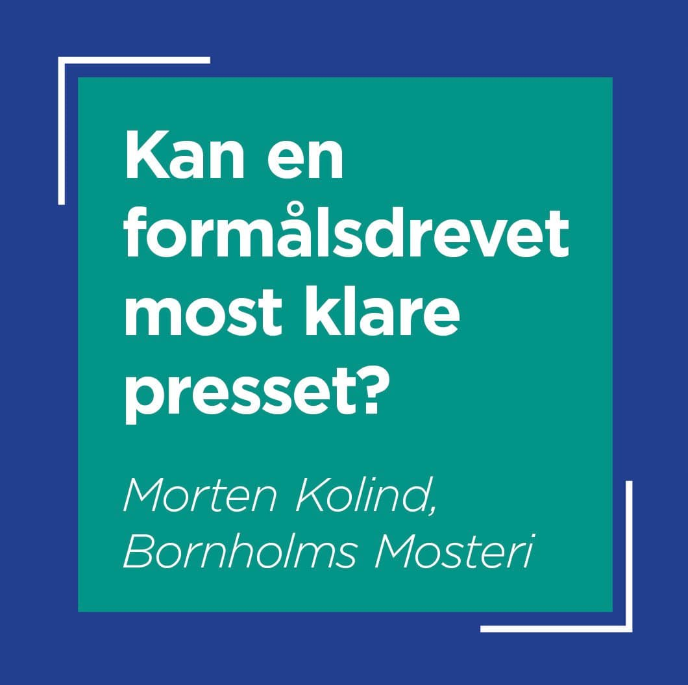
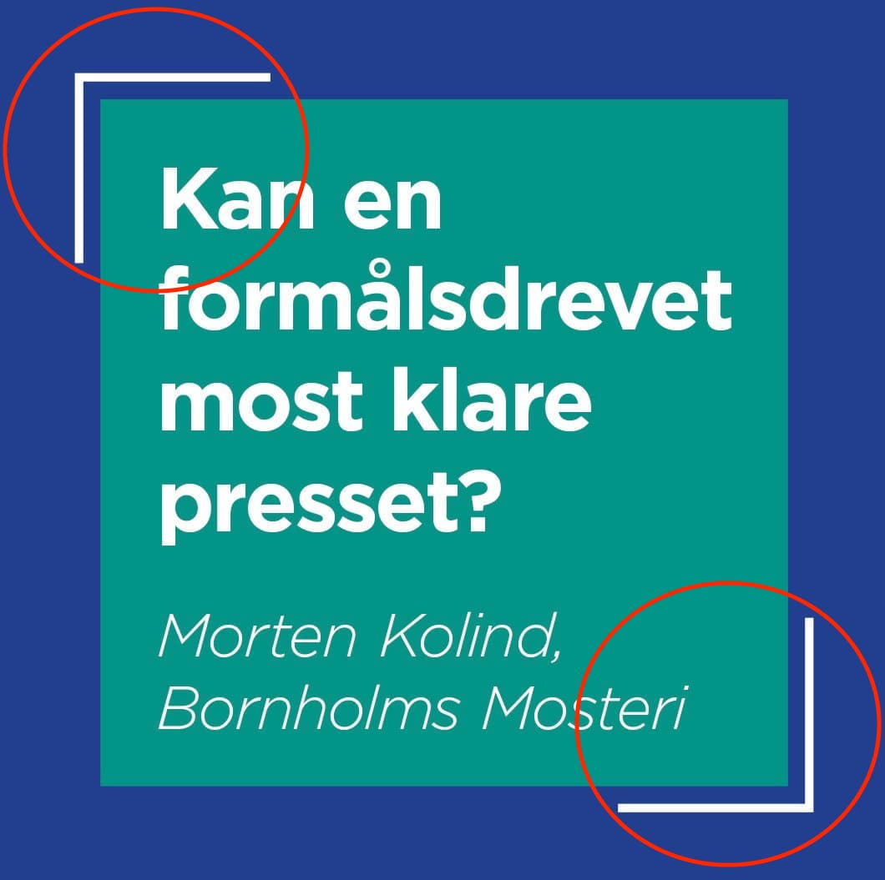

# Design challenge

## 06. Floating Borders

**Create the following layout:**

The main focus of this 20 minute design challenge is to add 'floating' borders to the card as you see in the picture above. Figure out how to introduce extra elements to the existing layout in order to achieve the desired effect.

You might want to look up pseudo-elements on MDN — more specifically `::before` and `::after`.

Be creative with your solutions, it doesn't have to be complicated `:)`

---

## Remember

This challenge contains some materials to get you started.  
Copy everything from the `assets` folder, to the `solution` folder.  
Use the terminal, and write: `cp ./assets/* ./solution/`

NB! Remember to copy it to the right folder.

And don't use more than 20 minutes on this challenge.
